# 🚀 GitHub Actions Capstone — Enterprise CI/CD Pipeline

[](https://github.com/prajyotfulsundar14/github-actions-capstone/actions/workflows/pr-pipeline.yml)
[](https://github.com/prajyotfulsundar14/github-actions-capstone/actions/workflows/main-pipeline.yml)
[](https://github.com/prajyotfulsundar14/github-actions-capstone/actions/workflows/health-check.yml)
[](https://github.com/prajyotfulsundar14/github-actions-capstone/actions/workflows/codeql.yml)
[](https://github.com/prajyotfulsundar14/github-actions-capstone/actions/workflows/release.yml)
[](LICENSE)
[](https://nodejs.org)
[](Dockerfile)

> A production-style, enterprise-grade CI/CD pipeline built entirely with
> **GitHub Actions** — covering build, test, containerization, security
> scanning, scheduled health checks, and gated production deployment. Built
> as the **Day 48 capstone project** for the
> [#90DaysOfDevOps](https://github.com/prajyotfulsundar14) journey with
> **TrainWithShubham**.

---

## ✨ What's Inside

| Category | Item |
| --- | --- |
| App | Node.js 20 + Express, with `/`, `/health`, `/api/v1/info` routes |
| Containerization | Multi-stage `Dockerfile` (deps → build/test → production, non-root user, `HEALTHCHECK`) |
| Local orchestration | `docker-compose.yml` with health checks & `.env` support |
| CI | Reusable **build & test** workflow (lint + Jest + coverage artifact) |
| CD | Reusable **Docker build & push** workflow (Buildx, GHA layer caching) |
| Pipelines | PR pipeline (test-only) · Main pipeline (build → test → docker → scan → deploy) · Release pipeline (tag-triggered) |
| Ops | Scheduled health check every 12 hours (`workflow_dispatch` for manual runs) |
| Security | **Trivy** container CVE scanning (fails build on CRITICAL) · **CodeQL** SAST · **Dependabot** for npm/Actions/Docker |
| Governance | Issue templates, PR template, `CODEOWNERS`, `SECURITY.md`, `CONTRIBUTING.md`, MIT `LICENSE` |

---

## 🏗️ Architecture

```mermaid
flowchart TD
    subgraph PR["Pull Request Flow"]
        A[PR opened / synchronize] --> B[reusable-build-test.yml<br/>lint + test]
        B --> C[pr-comment job<br/>posts PR summary]
    end

    subgraph MAIN["Main Branch Flow"]
        D[Push / Merge to main] --> E[1. Build & Test]
        E --> F[2. Docker Build & Push<br/>tags: latest, sha-xxxxx]
        F --> G[3. Trivy Security Scan<br/>fails on CRITICAL CVEs]
        G --> H[4. Deploy to production<br/>environment: production<br/>manual approval gate]
    end

    subgraph RELEASE["Release Flow"]
        I[git tag vX.Y.Z] --> J[Build & Test]
        J --> K[Docker Build & Push<br/>tag: vX.Y.Z + latest]
        K --> L[Create GitHub Release<br/>+ changelog]
    end

    subgraph OPS["Scheduled Ops"]
        M[Every 12 hours / manual] --> N[Pull latest image]
        N --> O[Run container + curl /health]
        O --> P[Report PASS/FAIL to Step Summary]
    end

    subgraph SEC["Continuous Security"]
        Q[Every push / PR / weekly] --> R[CodeQL SAST scan]
        R --> S[Results in Security tab]
    end
```



---

## 📂 Project Structure

```
github-actions-capstone/
├── src/
│   ├── app.js              # Express app (routes, middleware, error handling)
│   └── server.js            # Server bootstrap + graceful shutdown
├── tests/
│   └── app.test.js          # Jest + Supertest test suite
├── docs/
│   └── day-48-actions-project.md
├── .github/
│   ├── workflows/
│   │   ├── reusable-build-test.yml
│   │   ├── reusable-docker.yml
│   │   ├── pr-pipeline.yml
│   │   ├── main-pipeline.yml
│   │   ├── health-check.yml
│   │   ├── codeql.yml
│   │   └── release.yml
│   ├── ISSUE_TEMPLATE/
│   ├── PULL_REQUEST_TEMPLATE.md
│   ├── dependabot.yml
│   └── CODEOWNERS
├── Dockerfile
├── docker-compose.yml
├── .dockerignore
├── .gitignore
├── .env.example
├── .eslintrc.json
├── package.json
├── SECURITY.md
├── CONTRIBUTING.md
└── LICENSE
```

---

## 🚀 Quick Start

### Run locally

```bash
git clone https://github.com/<your-username>/github-actions-capstone.git
cd github-actions-capstone
cp .env.example .env
npm install
npm run dev
# → http://localhost:3000/health
```

### Run with Docker

```bash
docker compose up --build
```

### Run tests

```bash
npm test
```

---

## 🔐 Setting Up the Pipeline in Your Own Fork

1. **Repository secrets** (Settings → Secrets and variables → Actions):
   - `DOCKER_USERNAME` — your Docker Hub username
   - `DOCKER_TOKEN` — a Docker Hub access token (Account Settings → Security)
2. **Production environment** (Settings → Environments → New environment
   `production`): optionally enable **Required reviewers** to gate the
   `deploy` job behind manual approval.
3. Push to `main` (or open a PR first) and watch the Actions tab.

---

## 🗺️ Pipeline Flow Summary

```
PR opened          → build & test              → PR checks pass (comment posted)
Merge to main       → build & test → docker build & push → Trivy scan → deploy (manual approval)
Tag pushed (vX.Y.Z) → build & test → docker build & push → GitHub Release created
Every 12 hours       → pull latest image → health check → step summary report
Every push/PR/weekly → CodeQL SAST scan → results in Security tab
```

---

## 🧭 What's Next

- [ ] Slack / Teams notifications on pipeline failure
- [ ] Multi-environment promotion (staging → production)
- [ ] Blue/green or canary deployment strategy
- [ ] Automated rollback on failed health check post-deploy
- [ ] Kubernetes manifests + Helm chart for real cluster deployment

---

## 📄 License

Licensed under the [MIT License](LICENSE).

---

Built for **Day 48** of the **#90DaysOfDevOps** challenge.
`#DevOpsKaJosh` `#TrainWithShubham`
