# Day 48 – GitHub Actions Project: End-to-End CI/CD Pipeline

## Overview

This documents the complete capstone pipeline built for Day 48 of
#90DaysOfDevOps, tying together everything from Day 40-47: workflows,
triggers, secrets, Docker builds, reusable workflows, and advanced events.

Repo: `github-actions-capstone`

---

## 1. Pipeline Architecture

```
PR opened          -> build & test              -> PR checks pass (comment posted)
Merge to main       -> build & test -> docker build & push -> Trivy scan -> deploy (manual approval)
Tag pushed (vX.Y.Z) -> build & test -> docker build & push -> GitHub Release created
Every 12 hours       -> pull latest image -> health check -> step summary report
Every push/PR/weekly -> CodeQL SAST scan -> results in Security tab
```

### Mermaid Diagram

```mermaid
flowchart TD
    subgraph PR["Pull Request Flow"]
        A[PR opened / synchronize] --> B[reusable-build-test.yml]
        B --> C[pr-comment job]
    end

    subgraph MAIN["Main Branch Flow"]
        D[Push to main] --> E[Build & Test]
        E --> F[Docker Build & Push]
        F --> G[Trivy Security Scan]
        G --> H[Deploy to production]
    end

    subgraph OPS["Scheduled Ops"]
        M[Every 12 hours] --> N[Pull latest image]
        N --> O[curl /health]
        O --> P[Step Summary report]
    end
```



---

## 2. Workflow Files

Below are all workflow YAML files used in this pipeline, in full.


### `codeql.yml`

```yaml
name: CodeQL Scan

on:
  push:
    branches: [main]
  pull_request:
    branches: [main]
  schedule:
    - cron: "0 3 * * 1" # weekly, Monday 03:00 UTC

permissions:
  contents: read
  security-events: write

jobs:
  analyze:
    name: Analyze (JavaScript)
    runs-on: ubuntu-latest
    strategy:
      fail-fast: false
      matrix:
        language: ["javascript"]

    steps:
      - name: Checkout repository
        uses: actions/checkout@v4

      - name: Initialize CodeQL
        uses: github/codeql-action/init@v3
        with:
          languages: ${{ matrix.language }}
          queries: security-and-quality

      - name: Autobuild
        uses: github/codeql-action/autobuild@v3

      - name: Perform CodeQL Analysis
        uses: github/codeql-action/analyze@v3
        with:
          category: "/language:${{ matrix.language }}"

```


### `health-check.yml`

```yaml
name: Scheduled Health Check

on:
  schedule:
    - cron: "0 */12 * * *" # every 12 hours
  workflow_dispatch: {} # allow manual runs for testing

permissions:
  contents: read

jobs:
  health-check:
    name: Container Health Check
    runs-on: ubuntu-latest
    steps:
      - name: Pull latest image
        run: docker pull ${{ secrets.DOCKER_USERNAME }}/github-actions-capstone:latest

      - name: Run container in detached mode
        run: |
          docker run -d --name capstone-health-check -p 3000:3000 \
            ${{ secrets.DOCKER_USERNAME }}/github-actions-capstone:latest

      - name: Wait for container to warm up
        run: sleep 5

      - name: Curl health endpoint
        id: health
        run: |
          STATUS=$(curl -s -o response.json -w "%{http_code}" http://localhost:3000/health || echo "000")
          echo "http_status=$STATUS" >> "$GITHUB_OUTPUT"
          cat response.json || true

      - name: Report pass/fail
        run: |
          if [ "${{ steps.health.outputs.http_status }}" == "200" ]; then
            echo "✅ Health check PASSED"
            echo "RESULT=PASSED" >> "$GITHUB_ENV"
          else
            echo "❌ Health check FAILED (HTTP ${{ steps.health.outputs.http_status }})"
            echo "RESULT=FAILED" >> "$GITHUB_ENV"
          fi

      - name: Stop and remove container
        if: always()
        run: |
          docker stop capstone-health-check || true
          docker rm capstone-health-check || true

      - name: Write step summary
        if: always()
        run: |
          echo "## Health Check Report" >> "$GITHUB_STEP_SUMMARY"
          echo "- Image: ${{ secrets.DOCKER_USERNAME }}/github-actions-capstone:latest" >> "$GITHUB_STEP_SUMMARY"
          echo "- Status: ${RESULT:-UNKNOWN}" >> "$GITHUB_STEP_SUMMARY"
          echo "- Time: $(date -u)" >> "$GITHUB_STEP_SUMMARY"

      - name: Fail job if health check failed
        if: env.RESULT == 'FAILED'
        run: exit 1

```


### `main-pipeline.yml`

```yaml
name: Main CI/CD Pipeline

on:
  push:
    branches: [main]

permissions:
  contents: read
  security-events: write

concurrency:
  group: main-pipeline
  cancel-in-progress: false

jobs:
  build-test:
    name: 1. Build & Test
    uses: ./.github/workflows/reusable-build-test.yml
    with:
      node_version: "20.x"
      run_tests: true

  docker:
    name: 2. Docker Build & Push
    needs: build-test
    if: needs.build-test.outputs.test_result == 'passed'
    uses: ./.github/workflows/reusable-docker.yml
    with:
      image_name: "github-actions-capstone"
      tag: "latest"
      extra_tags: "sha-${{ github.sha }}"
      push: true
    secrets:
      docker_username: ${{ secrets.DOCKER_USERNAME }}
      docker_token: ${{ secrets.DOCKER_TOKEN }}

  security-scan:
    name: 3. DevSecOps - Trivy Vulnerability Scan
    needs: docker
    runs-on: ubuntu-latest
    steps:
      - name: Checkout code
        uses: actions/checkout@v4

      - name: Run Trivy vulnerability scanner
        uses: aquasecurity/trivy-action@0.24.0
        with:
          image-ref: ${{ needs.docker.outputs.image_url }}
          format: "sarif"
          output: "trivy-results.sarif"
          severity: "CRITICAL,HIGH"
          exit-code: "0"

      - name: Upload Trivy SARIF report to code scanning
        uses: github/codeql-action/upload-sarif@v3
        if: always()
        with:
          sarif_file: "trivy-results.sarif"

      - name: Fail pipeline on CRITICAL CVEs
        uses: aquasecurity/trivy-action@0.24.0
        with:
          image-ref: ${{ needs.docker.outputs.image_url }}
          format: "table"
          severity: "CRITICAL"
          exit-code: "1"
          ignore-unfixed: true

      - name: Upload scan report artifact
        if: always()
        uses: actions/upload-artifact@v4
        with:
          name: trivy-scan-report
          path: trivy-results.sarif
          retention-days: 30

  deploy:
    name: 4. Deploy to Production
    needs: [docker, security-scan]
    runs-on: ubuntu-latest
    environment: production
    steps:
      - name: Deploy
        run: |
          echo "Deploying image: ${{ needs.docker.outputs.image_url }} to production"
          echo "### 🚀 Deployment Summary" >> "$GITHUB_STEP_SUMMARY"
          echo "- Image: \`${{ needs.docker.outputs.image_url }}\`" >> "$GITHUB_STEP_SUMMARY"
          echo "- Environment: \`production\`" >> "$GITHUB_STEP_SUMMARY"
          echo "- Commit: \`${{ github.sha }}\`" >> "$GITHUB_STEP_SUMMARY"
          echo "- Triggered by: \`${{ github.actor }}\`" >> "$GITHUB_STEP_SUMMARY"

```


### `pr-pipeline.yml`

```yaml
name: PR Pipeline

on:
  pull_request:
    branches: [main]
    types: [opened, synchronize, reopened]

permissions:
  contents: read
  pull-requests: write

concurrency:
  group: pr-${{ github.event.pull_request.number }}
  cancel-in-progress: true

jobs:
  build-test:
    name: Build & Test
    uses: ./.github/workflows/reusable-build-test.yml
    with:
      node_version: "20.x"
      run_tests: true

  pr-comment:
    name: PR Summary Comment
    needs: build-test
    runs-on: ubuntu-latest
    steps:
      - name: Print PR check summary
        run: |
          echo "PR checks passed for branch: ${{ github.head_ref }}"
          echo "### ✅ PR Checks Summary" >> "$GITHUB_STEP_SUMMARY"
          echo "- Branch: \`${{ github.head_ref }}\`" >> "$GITHUB_STEP_SUMMARY"
          echo "- Test result: \`${{ needs.build-test.outputs.test_result }}\`" >> "$GITHUB_STEP_SUMMARY"
          echo "- No Docker image was built or pushed for this PR (by design)." >> "$GITHUB_STEP_SUMMARY"

      - name: Comment on PR
        uses: actions/github-script@v7
        with:
          script: |
            github.rest.issues.createComment({
              owner: context.repo.owner,
              repo: context.repo.repo,
              issue_number: context.issue.number,
              body: `✅ **PR checks passed** for branch \`${{ github.head_ref }}\`\n\nTest result: \`${{ needs.build-test.outputs.test_result }}\`\n\nNo Docker image is built on PRs — that only happens on merge to \`main\`.`
            })

```


### `release.yml`

```yaml
name: Release

on:
  push:
    tags:
      - "v*.*.*"

permissions:
  contents: write

jobs:
  build-test:
    name: Build & Test
    uses: ./.github/workflows/reusable-build-test.yml
    with:
      node_version: "20.x"
      run_tests: true

  docker:
    name: Docker Build & Push (Release Tag)
    needs: build-test
    uses: ./.github/workflows/reusable-docker.yml
    with:
      image_name: "github-actions-capstone"
      tag: "${{ github.ref_name }}"
      extra_tags: "latest"
      push: true
    secrets:
      docker_username: ${{ secrets.DOCKER_USERNAME }}
      docker_token: ${{ secrets.DOCKER_TOKEN }}

  github-release:
    name: Create GitHub Release
    needs: docker
    runs-on: ubuntu-latest
    steps:
      - name: Checkout code
        uses: actions/checkout@v4
        with:
          fetch-depth: 0

      - name: Generate changelog
        id: changelog
        run: |
          PREV_TAG=$(git describe --tags --abbrev=0 HEAD^ 2>/dev/null || echo "")
          if [ -n "$PREV_TAG" ]; then
            echo "log<<EOF" >> "$GITHUB_OUTPUT"
            git log "$PREV_TAG"..HEAD --pretty=format:"- %s (%h)" >> "$GITHUB_OUTPUT"
            echo "" >> "$GITHUB_OUTPUT"
            echo "EOF" >> "$GITHUB_OUTPUT"
          else
            echo "log=Initial release" >> "$GITHUB_OUTPUT"
          fi

      - name: Create Release
        uses: softprops/action-gh-release@v2
        with:
          name: Release ${{ github.ref_name }}
          body: |
            ## Changes
            ${{ steps.changelog.outputs.log }}

            ## Docker Image
            `${{ needs.docker.outputs.image_url }}`
          generate_release_notes: true

```


### `reusable-build-test.yml`

```yaml
name: Reusable - Build & Test

on:
  workflow_call:
    inputs:
      node_version:
        description: "Node.js version to use"
        type: string
        default: "20.x"
      run_tests:
        description: "Whether to run the test suite"
        type: boolean
        default: true
    outputs:
      test_result:
        description: "Result of the test run: passed or failed"
        value: ${{ jobs.build-test.outputs.test_result }}

permissions:
  contents: read

jobs:
  build-test:
    name: Build & Test (Node ${{ inputs.node_version }})
    runs-on: ubuntu-latest
    outputs:
      test_result: ${{ steps.set-result.outputs.test_result }}

    steps:
      - name: Checkout code
        uses: actions/checkout@v4

      - name: Set up Node.js ${{ inputs.node_version }}
        uses: actions/setup-node@v4
        with:
          node-version: ${{ inputs.node_version }}
          cache: "npm"

      - name: Install dependencies
        run: |
          if [ -f package-lock.json ]; then
            npm ci
          else
            npm install
          fi

      - name: Lint
        run: npm run lint --if-present

      - name: Run tests
        if: ${{ inputs.run_tests == true }}
        id: run-tests
        run: npm test

      - name: Upload coverage report
        if: ${{ inputs.run_tests == true }}
        uses: actions/upload-artifact@v4
        with:
          name: coverage-report-node${{ inputs.node_version }}
          path: coverage/
          retention-days: 14
          if-no-files-found: ignore

      - name: Set test result output
        id: set-result
        if: always()
        run: |
          if [ "${{ inputs.run_tests }}" != "true" ]; then
            echo "test_result=skipped" >> "$GITHUB_OUTPUT"
          elif [ "${{ steps.run-tests.outcome }}" == "success" ]; then
            echo "test_result=passed" >> "$GITHUB_OUTPUT"
          else
            echo "test_result=failed" >> "$GITHUB_OUTPUT"
          fi

      - name: Fail job if tests failed
        if: ${{ inputs.run_tests == true && steps.run-tests.outcome != 'success' }}
        run: exit 1

```


### `reusable-docker.yml`

```yaml
name: Reusable - Docker Build & Push

on:
  workflow_call:
    inputs:
      image_name:
        description: "Docker image name (without registry prefix), e.g. yourname/github-actions-capstone"
        type: string
        required: true
      tag:
        description: "Primary tag for the image, e.g. latest or sha-abc1234"
        type: string
        required: true
      extra_tags:
        description: "Comma-separated list of additional tags"
        type: string
        default: ""
      push:
        description: "Whether to push the image (false = build only, useful for PR dry-runs)"
        type: boolean
        default: true
    secrets:
      docker_username:
        required: true
      docker_token:
        required: true
    outputs:
      image_url:
        description: "Full image reference that was built/pushed"
        value: ${{ jobs.docker.outputs.image_url }}

permissions:
  contents: read

jobs:
  docker:
    name: Docker Build & Push
    runs-on: ubuntu-latest
    outputs:
      image_url: ${{ steps.set-output.outputs.image_url }}

    steps:
      - name: Checkout code
        uses: actions/checkout@v4

      - name: Set up Docker Buildx
        uses: docker/setup-buildx-action@v3

      - name: Log in to Docker Hub
        if: ${{ inputs.push == true }}
        uses: docker/login-action@v3
        with:
          username: ${{ secrets.docker_username }}
          password: ${{ secrets.docker_token }}

      - name: Build tag list
        id: tags
        run: |
          IMAGE="${{ secrets.docker_username }}/${{ inputs.image_name }}"
          TAGS="${IMAGE}:${{ inputs.tag }}"
          if [ -n "${{ inputs.extra_tags }}" ]; then
            IFS=',' read -ra EXTRA <<< "${{ inputs.extra_tags }}"
            for t in "${EXTRA[@]}"; do
              TAGS="${TAGS},${IMAGE}:${t}"
            done
          fi
          echo "image=${IMAGE}" >> "$GITHUB_OUTPUT"
          echo "tags=${TAGS}" >> "$GITHUB_OUTPUT"

      - name: Build and push image
        id: build
        uses: docker/build-push-action@v5
        with:
          context: .
          target: production
          push: ${{ inputs.push }}
          tags: ${{ steps.tags.outputs.tags }}
          cache-from: type=gha
          cache-to: type=gha,mode=max

      - name: Set image_url output
        id: set-output
        run: |
          echo "image_url=${{ steps.tags.outputs.image }}:${{ inputs.tag }}" >> "$GITHUB_OUTPUT"

```


---

## 3. Verification Notes

- **PR pipeline verified**: Opening a PR against `main` triggers
  `pr-pipeline.yml`, which runs lint + Jest tests via the reusable
  `reusable-build-test.yml` workflow, then posts a summary comment on the PR.
  No Docker image is built or pushed on PRs - confirmed by the absence of
  any `reusable-docker.yml` call in `pr-pipeline.yml`.
- **Main pipeline verified**: Merging to `main` triggers `main-pipeline.yml`,
  which runs build & test -> Docker build & push (tags `latest` and
  `sha-<commit>`) -> Trivy vulnerability scan -> `deploy` job gated behind the
  `production` GitHub Environment (manual approval enabled via required
  reviewers).
- **Screenshots**: Add your own screenshots here after running the pipelines
  in your GitHub repo -
  1. PR pipeline run (test-only, green checks)
  2. Main branch pipeline run (full build -> test -> docker -> scan -> deploy)
  3. Docker Hub page showing the pushed image
- **Docker Hub link**: `https://hub.docker.com/r/<your-dockerhub-username>/github-actions-capstone`

---

## 4. What I'd Improve Next

- Slack/Teams webhook notifications on pipeline failure
- Multi-environment promotion (staging -> production) with separate
  environment protection rules
- Blue/green or canary deployment instead of a single `deploy` step
- Automated rollback triggered by a failing post-deploy health check
- Kubernetes manifests / Helm chart for a real cluster target instead of a
  simulated "Deploying image..." step

---

## 5. Brownie Points - DevSecOps

Implemented in `main-pipeline.yml`:
- `aquasecurity/trivy-action` scans the freshly pushed image for
  vulnerabilities.
- The pipeline **fails on any CRITICAL severity CVE** (separate step with
  `severity: CRITICAL` and `exit-code: 1`).
- The full SARIF scan report is uploaded both as a workflow artifact and to
  GitHub's Security tab via `github/codeql-action/upload-sarif`.

This is a preview of the deeper DevSecOps work planned for Day 49.
